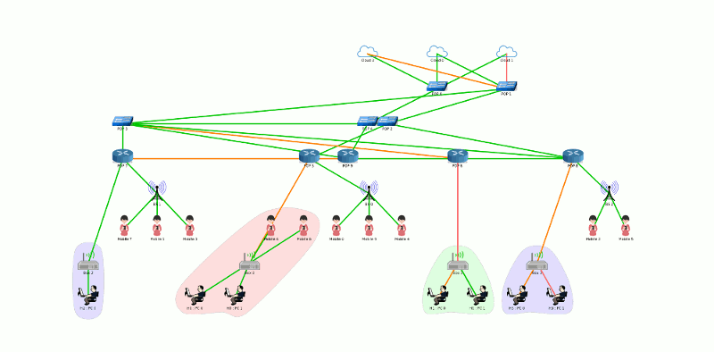
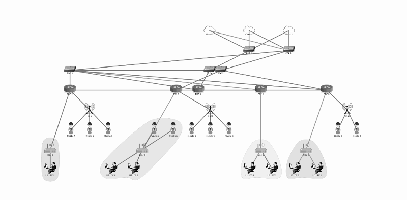
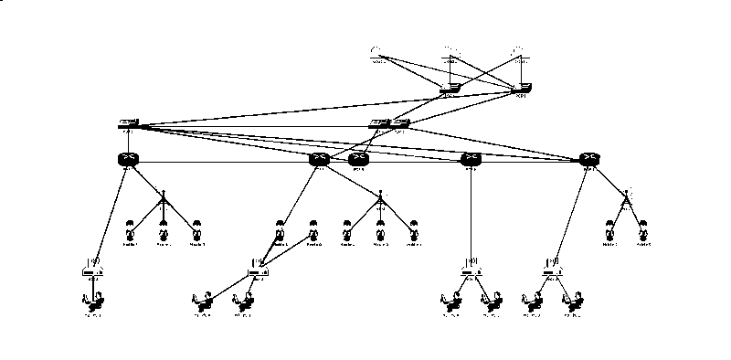

This tool supports converting a batch of ASCII ppm images (RAW ppm not supported) to pgm and pbm ones.

Generated image will be found in the same folder as its original ppm image, generated file's extension will be changed to ".pgm" or ".pbm". 

Threshold used to convert to pbm and weights of red, green and blue colors used to convert to pgm can be found in the head of main.c file as global variables.

 
Usage :

 1. `cd build`
 2. `cmake ../src`
 3. `make`
 4. `./2pgm {list of ppm files}`
 5. `./2pbm {list of ppm files}`

 
 - original ppm image

 

 - generated pgm image

 

 - generated pbm image

 

 license: Apache License 2.0

